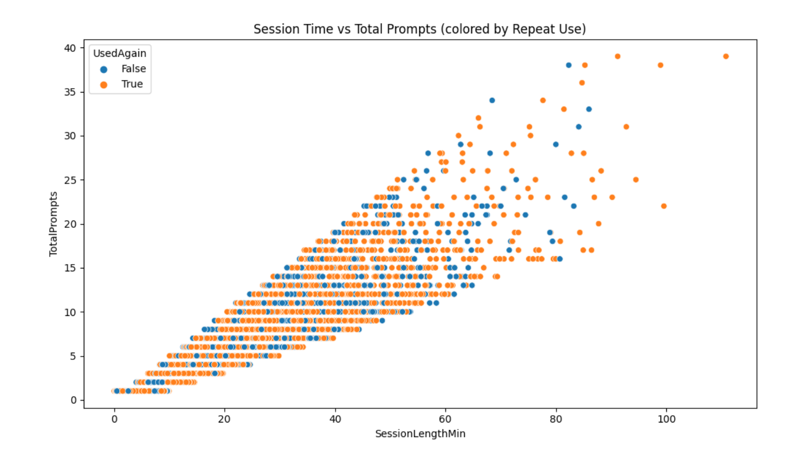
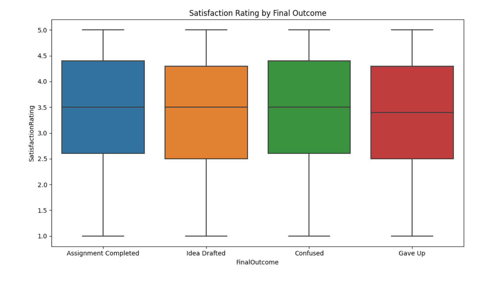
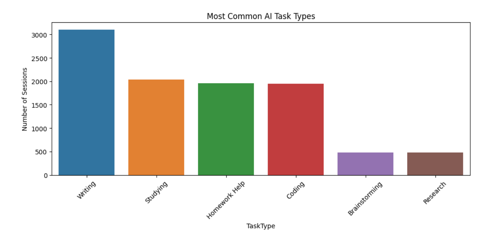
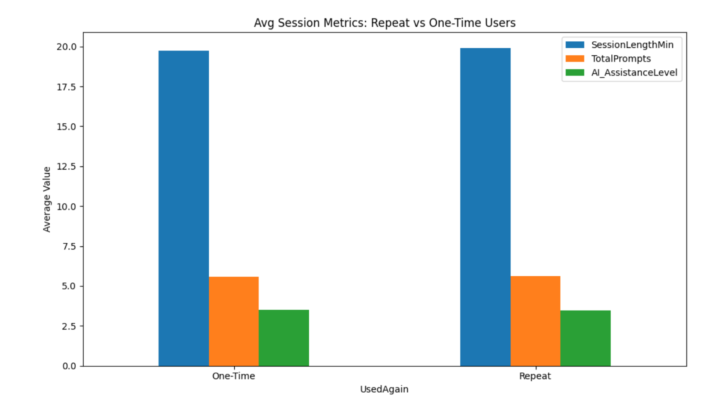
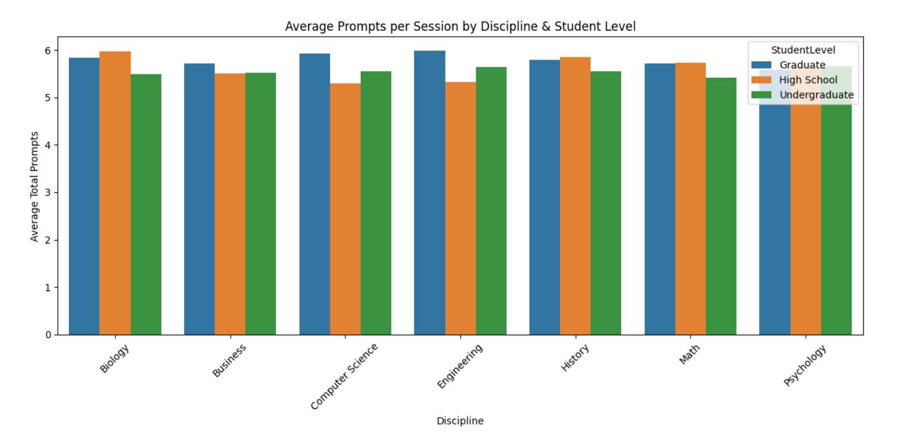

# AI Assistant Usage in Student Life

**Dataset:** 10,000 AI assistant usage sessions (Kaggle)  
**Notebook on Kaggle:** [View here](https://lnkd.in/djw_trkH)  
**YouTube Video (Norwegian):** [Watch here](https://lnkd.in/gPc3ubsM)

---

## 📌 Goal
To explore how students at different levels and disciplines use AI assistants in their academic life, and what factors influence engagement, repeat use, and satisfaction.  

---

## 📊 Key Insights
1. **Who interacts the most?**  
   Graduate engineering students had the highest average prompt usage, followed by high school biology students.  
   Undergraduate math students used AI the least.  

2. **What is AI used for?**  
   Writing tasks dominate usage. Brainstorming was the least common, suggesting students may prefer to think solo first.  

3. **What drives repeat use?**  
   Longer sessions + more prompts = higher likelihood of coming back.  
   Engagement depth matters more than one-off results.  

4. **Does satisfaction depend on outcome?**  
   Not entirely. Even students who didn’t complete assignments reported positive experiences. AI seems valued for support, not just solutions.  

---

## 🔹 Interesting Trend
There is a **strong linear relationship** between session length and number of prompts.  
Highly engaged users interacted more and were the most likely to return.  

---

## 🔧 Tools
- Python (Pandas, Seaborn, Matplotlib)  
- Jupyter Notebook  

---

## 🖼️ Visuals

### 1. Session Length vs Total Prompts
  

---

### 2. Satisfaction Ratings
  

---

### 3. Common AI Tasks
  

---

### 4. Average Session Metrics
  

---

### 5. Average Prompts by Group
  

